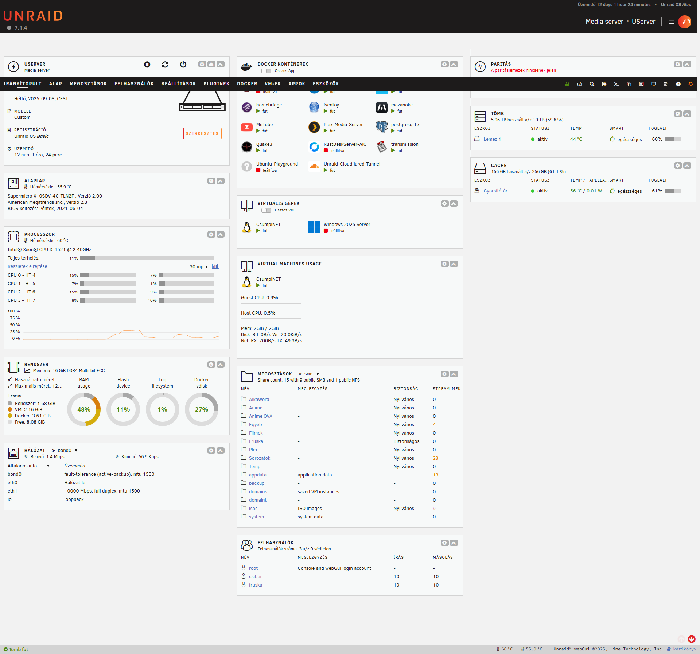
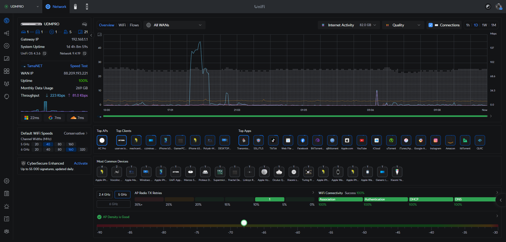

# Homelab – Unraid + Docker + Unifi + Cloudflare

This repository documents my personal **homelab infrastructure**,  
including server setup, automation scripts, and configuration notes.  

It serves as a showcase of my experience with **system administration,  
networking, and automation**, while also providing a knowledge base for  
future expansion.

---

## ✨ Features

- 🖥️ **Unraid Server** – storage, virtualization, GPU passthrough  
- 📡 **Unifi Network** – UDM Pro, PoE switches, APs, cameras  
- 🐳 **Docker Stacks** – Plex, Nextcloud, Transmission, custom apps  
- ☁️ **Cloudflare Tunnel** – secure remote access without port forwarding  
- 🔒 **Backup & Monitoring** – scripts and notes for data safety  

---

## 🛠️ Tech Stack

- **OS / Server:** Unraid on Supermicro hardware (quiet, low-power, NVMe support)  
- **Networking:** Unifi UDM Pro, PoE switches, Access Points, cameras  
- **Storage:** HDD + NVMe cache, RAID configs  
- **Containers:** Docker Compose (Plex, Nextcloud, Transmission, Dev stacks)  
- **Cloud:** Cloudflare Tunnel + DNS proxy  
- **Automation:** Bash, PowerShell, Python scripts  

---

## 📊 Diagram

*(to be added – later)*  

---

## 📸 Screenshots

| Unraid Dashboard | Unifi Controller |
|------------------|------------------|
|  |  |

---

## 📂 Repository Structure

```

homelab/
├─ README.md        <- main documentation
├─ docs/            <- detailed notes (unraid.md, unifi.md, docker.md, cloudflare.md)
├─ scripts/         <- automation scripts (bash, ps1, py)
├─ configs/         <- anonymized config samples (nginx.conf, firewall.json, docker-compose.yml)
└─ assets/          <- screenshots, diagrams

```

---

## 📌 Roadmap

- [ ] Add Ansible automation for Docker stack deployment  
- [ ] Expand monitoring with Prometheus + Grafana  
- [ ] Document UPS + solar integration  
- [ ] Add more Docker stacks (media, AI, productivity tools)  
- [ ] Publish more sysadmin notes (network hardening, backup strategies)  

---

## 🌍 Context

This homelab allows me to:  
- Test and deploy modern self-hosted services  
- Automate routine sysadmin tasks  
- Experiment with networking, storage, and virtualization  
- Maintain a safe environment for learning and prototyping  

It also forms the foundation for projects in the **HSWLP ecosystem**,  
where my development and infrastructure knowledge meet.  

---

## 📜 License

Released under the **MIT License**.  

---

**Homelab** is both my personal playground and a practical environment  
for exploring system administration, automation, and cloud-native workflows.
```
